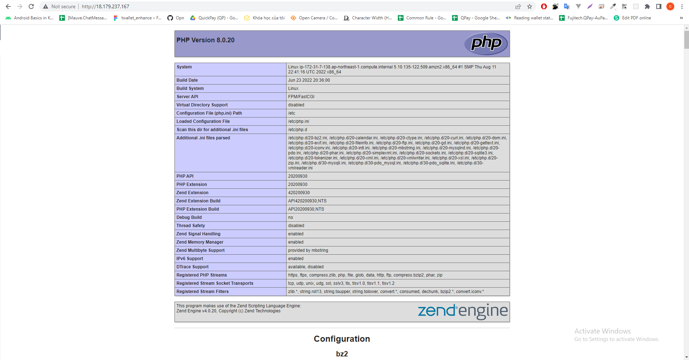
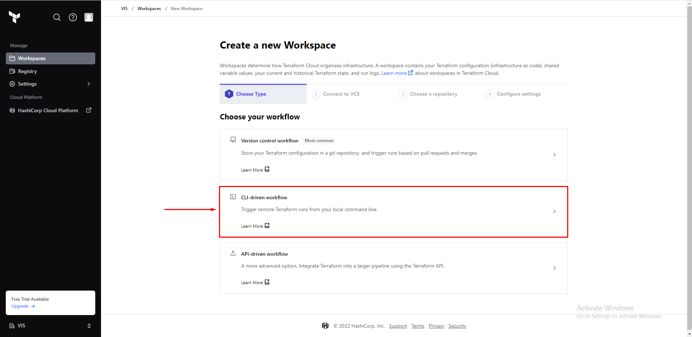
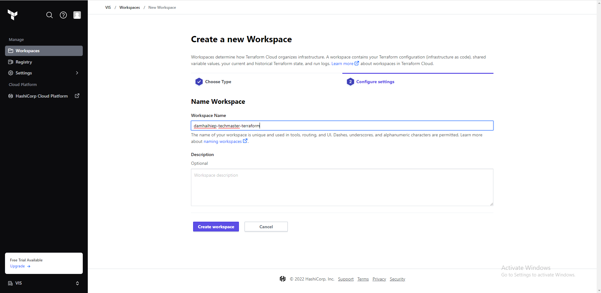
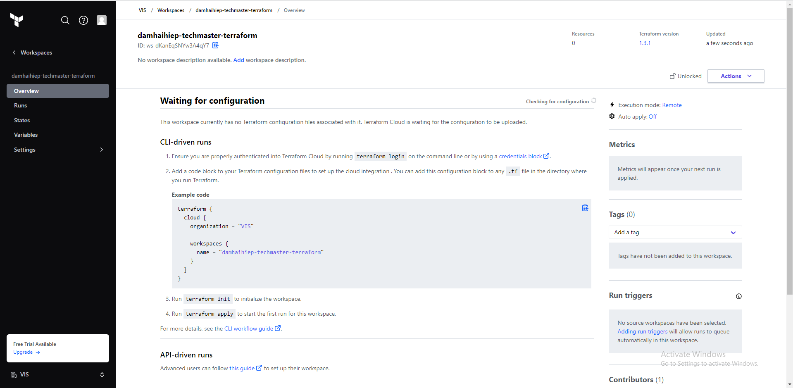
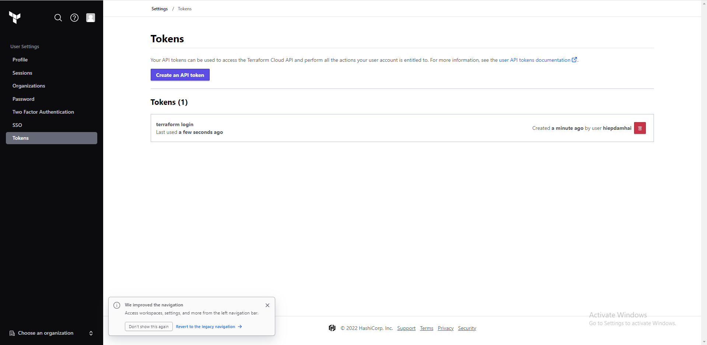
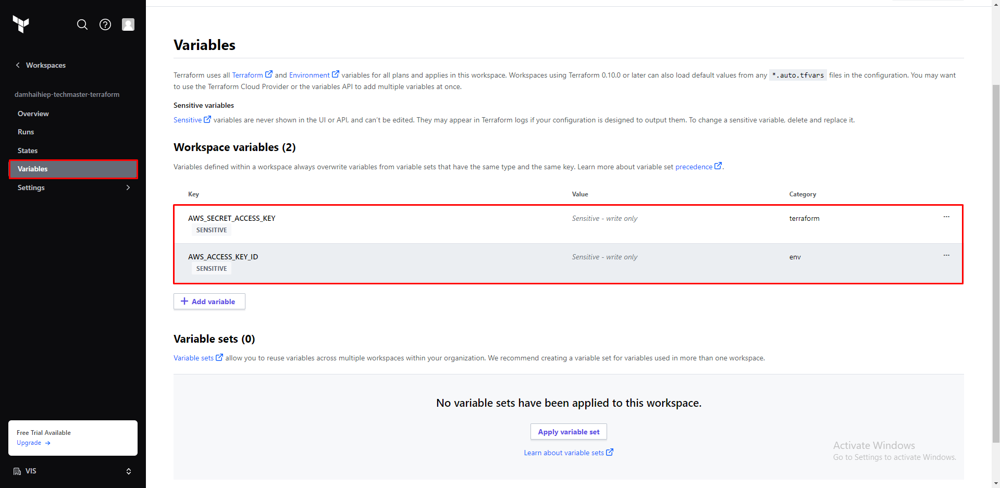

#Bai4  
URL: http://18.179.237.167  
Image Evidence:  

#Các step thực hiện

1. Create account Terraform Cloud => Start from scratch
2. Choose workflow => CLI-driven workflow  
   
3. Create workspaces  
     
   
4. Create main.tf và copy thêm đoạn Example code được sinh ra sau khi tạo workspaces
5. Thực hiện chạy lệnh "terraform login" trên terminal => Trên trình duyệt terraform sẽ mở ra giao diện Create API Token => Create API Token  
   
6. Copy Token dán vào terminal
7. Chạy lệnh "terraform init"
8. Thực hiện Setting Variables trong workspaces terraform cloud  
   
9. Chạy lệnh "terraform plan" (Sẽ có thể xảy ra các lỗi sau: Chưa tạo Elastic IP, ami của aws không đúng => chúng ta sẽ thực hiện tạo Elastic IP và sửa lại ami cho đúng)
10. Chạy lệnh "terraform apply -auto-approve"
